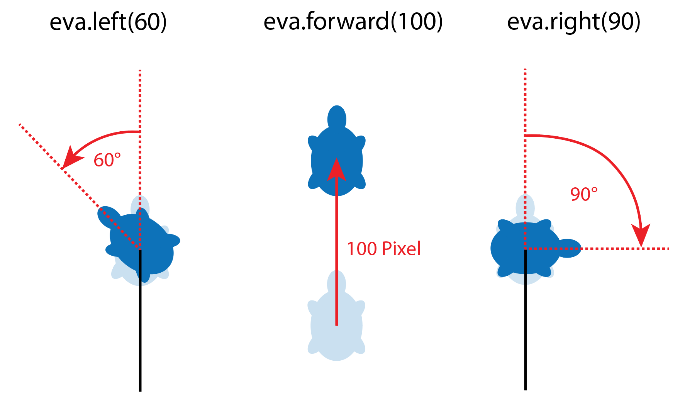

> [!success] Lernziele
> 
> - Sie können lokal auf Ihrem Computer **ein Python-Programm schreiben und ausführen**.
> - Sie kennen können **Variablen** (z.B. `name = "Melanie"`), **Funktionen** (z.B. `print("Hello world!")` oder `input("Geben Sie Ihren Namen ein")` und **Pakete** (z.B. `import turtle`) in einem Python-Programm benennen.

Beim Programmieren liegen Spass und Frust nahe beieinander - und den Unterschied macht Ihr Einsatz. Ich verspreche Ihnen vorweg so viel: Es ist keine Zauberei. **Alle können programmieren lernen**.

Computerprogramme bestehen aus einer Reihe von Anweisungen, die in einer bestimmten Reihenfolge ablaufen, so wie Sie es bereits [mit dem "Little Man Computer" simuliert](../01-aufbau/hw-04-vonneumann.mdx) haben. Zum Glück ist das Programmieren heute jedoch komfortabler, weil wir **Programmiersprachen** verwenden, die eine **menschliche Syntax** bieten und uns von der direkten Speicherverwaltung entlasten. **Python** ist eine besonders weit verbreitete Programmiersprache, die sich dank ihrer einfachen Syntax, Erweiterbarkeit und Lesbarkeit durchgesetzt hat.

Um zu verstehen, was eine Programmiersprache für uns tut, können Sie sich daran orientieren, was [im "Little Man Computer"](../01-aufbau/hw-04-vonneumann.mdx) alles mühsam war.
- Wir mussten uns **Speicheradressen** als Zahlen merken 😑 Wenn sich das Programm verlängert hat, mussten wir diese Zahlen überall anpassen 🤬
- Wir konnten nie unsere **Lösungen wiederverwenden** 😥 Z.B. haben wir eine Multiplikation erstellt, aber dann für die Fakultät mussten wir wieder von vorne beginnen, obwohl das ja mehrere Multiplikationen sind! 🥵
- Die **Befehle** waren Zahlen, die man sich merken musste 🤯

Eine Programmiersprache löst all diese Probleme, indem sie **vom Machinencode abstrahiert**. Wir müssen uns nie mehr eine Speicheradresse merken, können Dinge wiederverwenden und Befehle als Wörter schreiben. 🥳🙌
## Ein minimalistisches Python-Programm

> [!hint] Ein Tipp vorweg
> 
> Sie lernen jetzt eine neue Sprache. Ich empfehle Ihnen: Behandeln Sie das Lernen einer Programmiersprache anfangs sehr ähnlich wie eine natürliche Sprache und schreiben Sie sich **Voci-Kärtchen**.

Beginnen wir mit einem kurzen Python-Programm aus zwei Linien. Führen Sie das gern einfach mal aus indem Sie auf "▶️ Run" drücken, dann besprechen wir den Inhalt.

```turtle
name = "Melanie"
print("Schön, dass Sie da sind,", name, "! Willkommen!")
```

Hier wird ein Name gespeichert und dann als Teil eines Satzes wieder ausgegeben.
- Das Programm wird **Schritt für Schritt** ausgeführt, wie im LMC.
* Auf Linie 1 wird im Speicher eine **Variable** `name` erstellt und in ihr wird der **Wert** `"Melanie"` gespeichert. Wir sehen:
	* Wir müssen uns **keine Speicheraddresse merken**!
	* Ein **Gleichheitszeichen** `=` in Python ist kein *Ver*gleich, sondern ein Befehl, der der Variabel einen neuen Wert zuweist.
* Auf Linie 2 wird der Wert der Variable `name` in einen Satz eingefügt und mit **print(...)** ausgegeben. Einen solchen Befehl nennen wir eine **Funktion**. Wir sehen:
	* Variablen und Funktionen sind unterschiedliche Dinge: **Variablen *speichern* etwas**, **Funktionen *tun* etwas**.
	* **Funktionen** erkennt man an den **runden Klammern**, in denen man der Funktion Werte zur Weiterverarbeitung übergeben kann, z.B. `print("Gebe diese Satz aus")`.
	* Man kann in Python verschiedene Zeichenketten einfach mit einem `+` zu einer Zeichenkette aneinanderketten.

> [!example] Jetzt sind Sie dran!
> 
> Ändern Sie den Namen, der ausgegeben wird und führen Sie das Programm aus.

Jetzt ändern wir das Programm ab, dass die Variable `name` nicht einen vordefinierten Wert speichert, sondern dass **unsere User nach ihrem Namen gefragt werden** und ihre Eingabe in der Variable `name` gespeichert wird. Das tönt kompliziert, aber tatsächlich übernimmt die Funktion `input()` die ganze Arbeit. 

```python {hl_lines="1"}
name = input("Bitte geben Sie Ihren Namen ein:")
print("Schön, dass Sie da sind, " + name + "! Willkommen!")
```

> [!example] Jetzt sind Sie dran!
> 
> Ändern Sie das Programm ab und führen Sie es aus.

```turtle
name = "Melanie"
print("Schön, dass Sie da sind, " + name + "! Willkommen!")
```

Daraus lernen wir:
* Der Wert für die Variable `name` wird nun **von der Funktion `input(...)`** geliefert. Das heisst: Funktionen können Werte nicht nur in den Klammern **entgegennehmen** ("Bitte geben Sie Ihren Namen ein") und **verarbeiten** (ein kleines Fensterchen mit diesem Satz anzeigen), sondern auch einen Wert **zurückgeben**. Funktionen können also alle Stationen des **EVA**-Prinzips.

> [!info] Zusammenfassung
> 
> ```
> name = "Melanie"
> print("Schön, dass Sie da sind, " + name + "! Willkommen!")
> ```
> Wir haben daraus gelernt:
> - Ein Programm wird **Schritt für Schritt** ausgeführt.
> - `name` ist eine **Variable** und speichert den Wert `"Melanie"`.
> - Wenn wir `name` erneut einen Wert geben, wird die Variable **überschrieben**.
> - Ein einzelnes Gleichheitszeichen `=` ist beim Programmieren **kein *Ver*gleich**, sondern eine **Wert*zuweisung*** - z.B. oft für eine Variable.
> - **Funktionen** sind Teilprogramme, die etwas **tun**. Man erkennt sie an den **runden Klammern**, z.B. `print(...)`.
> - **Variablen *speichern* etwas**, **Funktionen *tun* etwas**.
> 
## Unser Programm mit bestehenden Bibliotheken erweitern

Sie sind sicher einverstanden, dass wir nur wissen, was die Funktionen `input(...)` und `print(...)` machen – aber wir haben keine Ahnung, wie sie tatsächlich funktionieren. Jemand hat diese Funktionen für uns programmiert und wir gebrauchen sie einfach. Das ist im Programmieren ganz oft so, dass wir **auf bestehendem Code aufbauen**.

`input(...)` und `print(...)`  gehören zum Standard-Repertoire von Python. Aber man kann die Sprache noch viel weiter erweitern mit **Modulen, Paketen und Bibliotheken** aus aller Welt.

> [!note]- Zusatz: Modul, Paket und Bibliothek?
> 
> * Ein **Modul** ist eine Python-Datei, deren Funktionen *et cetera* man importieren kann.
> * Ein **Paket** ist ein ganzer Ordner voller Module, die ähnliche Dinge erledigen. Es kann auch Helferprogramme in anderen Programmiersprachen (Beispiel [Numpy](https://github.com/numpy/numpy)) enthalten.
> * Eine **Bibliothek** ist ein vager Sammelbegriff und wird hier synonym für grössere Pakete verwendet.

Für diesen Einstieg werden wir eine Bibliothek namens "turtle" verwenden. Mit diesem Paket können wir einfache Zeichnungen erstellen und so visuell programmieren lernen. Beginnen wir damit, die Turtle-Bibliothek zu importieren:

```python
import turtle
```

Durch den Import der Turtle-Bibliothek haben wir nun Zugriff auf alles, was darin enthalten ist. Damit können wir jetzt eine Schildkröte erstellen und ihr einen Namen geben. Wir nennen unsere Schildkröte "eva", weil das kurz und bündig ist:

```python
eva = turtle.Turtle()
```

Nun können wir eva sagen, was sie tun soll. Beispielsweise können wir ihr sagen, dass sie 80 Schritte vorwärts gehen, sich um 60° nach rechts drehen und dann wieder 60 Schritte vorwärts gehen soll:

```python
eva.forward(80)
eva.right(60)
eva.forward(60)
```

Alles zusammen sieht dann so aus. Sie können das Programm ausführen, indem Sie auf "▶️ Run" drücken.

```turtle
import turtle
eva = turtle.Turtle()

eva.forward(80)
eva.right(60)
eva.forward(60)

```

Mit diesen wenigen Zeilen Code können Sie Ihrer Schildkröte "eva" also bereits einfache Anweisungen geben und Zeichnungen erstellen. 

> [!example] Jetzt sind Sie dran!
> 
> Versuchen Sie mal folgende Figuren nachzumachen. (Grösse und Farbe müssen nicht stimmen.)

![[01-turtleintro-exercises.excalidraw]]

> [!info] Zusammenfassung
> 
> - Programme kann man mit Modulen, Paketen und Bibliotheken erweitern.
> - Wir importieren die Bibliothek `turtle` mit dem Befehl `import turtle`
> - `eva = turtle.Turtle()` erzeugt eine Turtle mit dem Namen `eva`.
> - Die Turtle befolgt die Anweisungen **Schritt für Schritt**.
> - Die Turtle dreht sich um den **Aussenwinkel**.
> 

## Python lokal installieren

Falls wir das noch nicht getan haben, installieren Sie bitte auf Ihrem Computer Python und unseren Programmier-Editor Visual Studio Code. Eine Anleitung dazu [finden Sie in den FAQs](../faq.mdx#editor-und-python-installieren).
## Von einer Programmiersprache zu Bit und Bytes

Wie wird der Code einer Programmiersprache zu den Bits und Bytes, die der Computer ausführt? Der Ablauf lässt sich so darstellen:
1. **Quellcode in einer Programmiersprache**: Das ist der von Ihnen geschriebene Code in Sprachen wie C, C++, Rust oder Go (kompilierte Sprachen) oder in Sprachen wie JavaScript oder Python (interpretierte Sprachen). Diese Sprachen sind für Menschen gut lesbar und folgen klar definierten **Syntaxregeln**.
2. **Kompilierung oder Interpretierung**:
    - **Kompilierung**: Ein Compiler übersetzt den gesamten Quellcode einer kompilierenden Sprache (z. B. C, C++) in Maschinencode. Das Ergebnis ist eine ausführbare Binärdatei, die direkt von der CPU ausgeführt werden kann, wodurch Programme sehr effizient und schnell ablaufen.
    - **Interpretierung**: Bei interpretierten Sprachen (Python, Javascript, Java) wird Ihr Programm nicht in Maschinencode für Ihren Prozessor übersetzt und dann ausgeführt. Stattdessen läuft ein Programm names "Interpreter", das Ihr Programm in einer "virtuellen Maschine" ausführt. Alle Leute, die ein normales Python-Programm ausführen wollen, müssen Python installiert haben - und damit diesen Interpreter.
3. **Assemblercode**: Bei vielen kompilierenden Sprachen wird der Code zunächst in eine niedrigere Abstraktionsebene, den Assemblercode, übersetzt. Dieser Code ist näher an der Maschinensprache und verwendet eine spezifische Anweisungssprache, die die CPU versteht, jedoch noch nicht direkt ausführbar ist.
4. **Maschinencode**: Der Maschinencode ist die niedrigste Ebene der Programmiersprachen und besteht aus einer Abfolge von Binärcodes (nur aus den Zahlen 0 und 1). Wir haben eine vereinfachte, dezimale Version davon im ["Little Man Computer" simuliert](../01-aufbau/hw-04-vonneumann.mdx).

![[01-turtleintro-compileinterpret.excalidraw]]