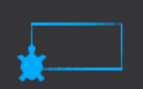
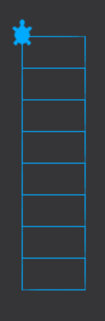
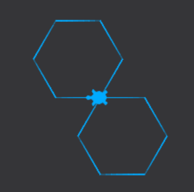
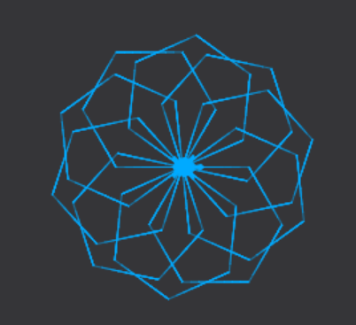
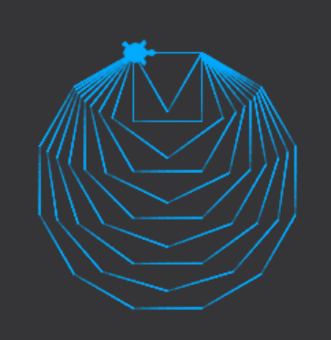
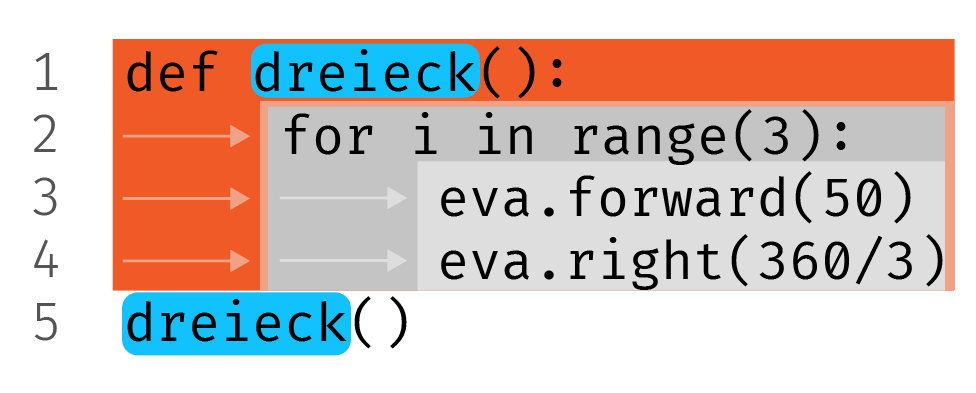
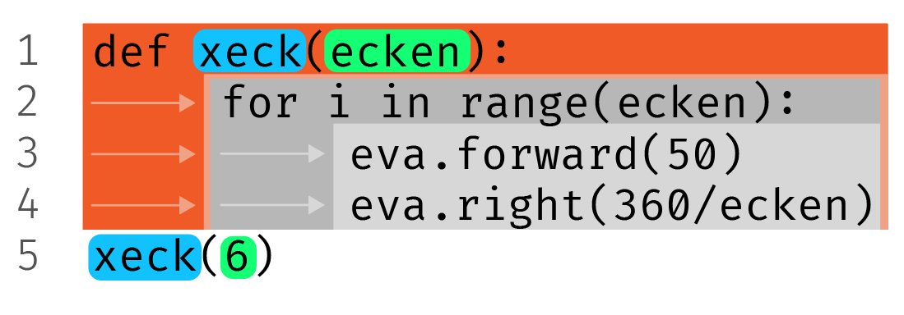

Funktionen in Python sind Unterprogramme, die eine spezifische Aufgabe erfüllen.
Sie können sowohl mit als auch ohne Parameter definiert werden.

## Funktionen ohne Parameter

Geschrieben werden Funktionen wie andere Codeblöcke auch. Sie können eine Funktion definieren, die keine Argumente benötigt, wie im folgenden Beispiel:

```python
def dreieck():
    for i in range(3):
        eva.forward(100)
        eva.right(360/3)

dreieck()
```

## Funktionen mit Parametern

Manchmal möchten Sie der Funktion spezifische Informationen übergeben, damit sie
ihre Aufgabe erfüllen kann. Diese Informationen nennen wir **Argumente**, die in
die **Parameter** der Funktion abgefüllt werden.

```python
def dreieck(seitenlaenge):
    for i in range(3):
        eva.forward(seitenlaenge)
        eva.right(360/3)
```

Um diese Funktion auszuführen, können Sie ihr beim Aufruf beispielsweise den
Wert `50` als Argument übergeben, der dann in das Parameter `seitenlaenge`
gefüllt wird.

```python
dreieck(50)
```

> [!danger] Achtung
>
> Funktionen erhalten eine **separaten, temporären Speicherbereich vom
> Hauptprogramm**. Die Parameter sowie alle Variablen, die in der Funktion
> kreiert werden, werden immer nur temporär erstellt und am Schluss zusammen mit
> dem gesamten Speicherbereich der Funktion wieder zerstört!
>
> <iframe width="100%" height="500" frameborder="0" src="https://pythontutor.com/iframe-embed.html#code=def%20sag_hallo%28nachricht%29%3A%0A%20%20%20%20anrede%20%3D%20%22Hallo.%22%0A%20%20%20%20print%28anrede,%20nachricht%29%0A%0A%23%20Variabeln%20im%20Hauptprogramm%0Azahl%20%3D%2042%0Atext%20%3D%20%22Wort%22%0A%0Asag_hallo%28%22Tsch%C3%BCss.%22%29&codeDivHeight=400&codeDivWidth=350&cumulative=false&curInstr=0&heapPrimitives=nevernest&origin=opt-frontend.js&py=3&rawInputLstJSON=%5B%5D&textReferences=false"> </iframe>

## Funktionen "verschachteln"

Eine Funktion kann alle anderen Funktionen nutzen. z.B. hier nutzt die Funktion
`blume()` die Funktion `dreieck()`.

```python
def dreieck():
    for i in range(3):
        eva.forward(50)
        eva.right(360/3)

def blume():
    for i in range(8):
        dreieck()
        eva.right(360/8)

blume()
```

## Übungen



> [!question]- Schreiben Sie eine Funktion `rechteck()`, die ein Rechteck wie
> oben zeichnet 👆.
>
> ```python
> eva.left(90) # Das muss man in TigerJython NICHT machen, da die Turtle bereits nach oben schaut.
>
> def rechteck():
> 	for i in range(2):
> 		eva.forward(30)
> 		eva.right(90)
> 		eva.forward(60)
> 		eva.right(90)
>
> rechteck()
> ```

---

Eine Funktion kann alle anderen Funktionen gebrauchen.



> [!question]- Nutzen Sie Ihre Funktion `rechteck()` in einer zweiten Funktion
> `treppe(stufen)`, die uns eine Treppe mit Anzahl `stufen` zeichnet – oben
> beispielsweise mit `treppen(8)` aufgerufen.
>
> ```python
>
> eva.left(90) # Das muss man in TigerJython NICHT machen, da die Turtle bereits nach oben schaut.
>
> def rechteck():
> 	for i in range(2):
> 		eva.forward(30)
> 		eva.right(90)
> 		eva.forward(60)
> 		eva.right(90)
>
> def treppe(stufen):
> 	for i in range(stufen):
> 		rechteck()
> 		eva.forward(30)
>
> treppe(8)
> ```

---

Erinnern Sie sich an folgenden Code und lösen Sie damit die anschliessenden
Übungen:

```python
for i in range(6):
    eva.forward(50)
    eva.right(360/6)
```



> [!question]- Erstellen Sie eine Funktion `sechseck()` und führen Sie sie
> zweimal so aus, dass die Form einer Acht wie oben 👆 entsteht.
>
> ```python
> def sechseck():
> 	for i in range(6):
> 		eva.forward(50)
> 		eva.right(360/6)
>
> sechseck()
> eva.right(180)
> sechseck()
> ```

---



> [!question]- Nutzen Sie `sechseck()` und machen Sie eine Blume 🌺 aus 10
> gleichmässig rotierten Sechsecken.
>
> ```python
> def sechseck():
> 	for i in range(6):
> 		eva.forward(50)
> 		eva.right(360/6)
>
> for i in range(10):
> 	sechseck()
> 	eva.right(360/10)
> ```

---


> [!question]- Verändern Sie die Funktion zu einer Funktion `xeck(ecken)`, bei
> der man die Anzahl Ecken der Figur als Argument übergeben kann. Machen Sie
> dann ein Dreieck, ein Viereck und ein Siebeneck.
>
> ```python
> def xeck(ecken):
> 	for i in range(ecken):
> 		eva.forward(50)
> 		eva.right(360/ecken)
>
> xeck(3)
> xeck(4)
> xeck(7)
> ```

---

Für folgende Aufgabe müssen Sie wissen, wie man Variabeln während einer
Wiederholungsschleife verändert.



> [!question]- Nutzen Sie Ihre Funktion `xeck(ecken)` und schreiben Sie eine
> **Wiederholungsschleife**, die alle Figuren von einem Dreieck bis zu einem
> Zwölfeck zeichnet.
>
> ```python
> def xeck(ecken):
> 	for i in range(ecken):
> 		eva.forward(50)
> 		eva.right(360/ecken)
>
> figur = 3
>
> for i in range(10):
> 	xeck(figur)
> 	figur = figur + 1
> ```

### Zusammenfassung

> [!info] Zusammenfassung
>
> **Funktionen** sind Unterprogramme, die eine bestimmte Aufgabe erfüllen. Man
> muss eine Funktion:
>
> -   Mit **`def` zuerst definieren** – der Funktion also einen <span
>     style={{backgroundColor: "#12C2FF", color: "black", padding:"2px", borderRadius:"3px"}}>Namen</span>
>     geben und bestimmen, was sie tut (Linie 1 - 4).
> -   Die Funktion **ausführen** – der Computer findet die Funktion im Speicher
>     anhand ihres <span
>     style={{backgroundColor: "#12C2FF", color: "black", padding:"2px", borderRadius:"3px"}}>Namens</span>
>     (Linie 5).
>
> 
>
> Manchmal möchten wir einer Funktion **Informationen übergeben**. Hier wird
> beispielsweise der Wert <span
> style={{backgroundColor: "#15FF74", color: "black", padding:"2px", borderRadius:"3px"}}>6</span>
> als **Argument** der Funktion übergeben und in das **Parameter** <span
> style={{backgroundColor: "#15FF74", color: "black", padding:"2px", borderRadius:"3px"}}>ecken</span>
> der Funktion abgefüllt.
>
> 
> Wichtig: Parameter (<span
> style={{backgroundColor: "#15FF74", color: "black", padding:"2px", borderRadius:"3px"}}>ecken</span>)
> werden bei jeder Ausführung **temporär** kreiert und wieder zerstört!
