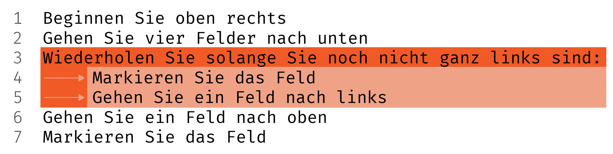
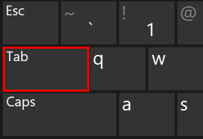

> [!note] Notiz für Lehrperson
> 
> Übungen verteilen und machen wir jeweils in OneNote. Sie finden alles [in diesem Notizbuch](https://kswe-my.sharepoint.com/:o:/g/personal/cha_kswe_ch/EoV9M1uM6bdBuBRAetwQGdgB4LmAyYwvPxW6xpmzYIY3SQ?e=V2Q19j).

Vielleicht ist es Ihnen in der [Lektion 2](turtleintro) beim Programmieren aufgefallen, als Sie das Quadrat gemacht haben:

```python
import turtle
eva = turtle.Turtle()

eva.forward(100)
eva.right(90)
eva.forward(100)
eva.right(90)
eva.forward(100)
eva.right(90)
eva.forward(100)
eva.right(90)
```

Das ist nicht sehr elegant. Die Linien wiederholen sich ständig! Gibt es da nicht eine einfachere Lösung?

Ja, und zwar **Wiederholungs-Schleifen**.

## Schleifen: Wiederholungen im Algorithmus

Wir lösen zusammen die Übung **L03 Wiederholen Intro** [im Klassennotizbuch](https://kswe-my.sharepoint.com/:o:/g/personal/cha_kswe_ch/EoV9M1uM6bdBuBRAetwQGdgB4LmAyYwvPxW6xpmzYIY3SQ?e=V2Q19j) mit folgendem Algorithmus:

```
Beginnen Sie im Feld oben links
Gehen Sie drei Felder nach unten
Wiederholen Sie 5-mal:
	Gehen Sie ein Feld nach rechts
	Markieren Sie das Feld
Gehen Sie zwei Felder nach oben
Markieren Sie das Feld
```

> [!example] Jetzt sind Sie dran!
> 
> Versuchen Sie nun selbst die Übung **L03 Wiederholen 2** mit folgendem Algorithmus.
> ```
> Beginnen Sie im Feld oben rechts
> Gehen Sie drei Felder nach unten
> Wiederholen Sie, bis Sie ganz links sind:
> 	Markieren Sie das Feld
> 	Gehen Sie ein Feld nach links
> Gehen Sie zwei Felder nach oben
> Markieren Sie das Feld
> ```

Nach der Klassendiskussion machen wir einen Eintrag ins Theorieheft.

> [!info] Eintrag ins Theorieheft
> 
> ## Anatomie von Wiederholungsschleifen und anderen Codeblöcken
> 
> Wie weiss der Computer, **welche Linien zur Wiederholungsschleife gehören**? Die Antwort sind **Codeblöcke**!
>  
> - Die **oberste Linie des Blocks** hat einen **Doppelpunkt** (hier auf Linie 3). Bei der `repeat`-Schleife wird hier definiert, wie oft oder wie lange der **Block als Ganzes wiederholt** wird. Diese Bedingung wird einmal vor jeder Wiederholung des Blocks überprüft.
> - Zum Block gehören dann alle Linien, die **mindestens einmal mehr eingezogen** sind, also die einen Abstand mehr haben als die Linie mit dem Doppelpunkt. 
> 
> 
> - Den Abstand können Sie mit der **Tabulatorentaste** links neben "Q" machen.
> 	

> [!example] Jetzt sind Sie dran!
> 
> Versuchen Sie diese etwas kompliziertere  Übung mit einer Repeat-Schleife und einer S.
> ```
> Beginnen Sie oben rechts
> Gehen Sie vier Felder nach unten
> Wiederholen Sie solange Sie noch nicht ganz links sind:
> 	wenn Sie von link her gezählt in einem ungeraden Feld sind:
> 		Wählen Sie die Farbe Rot
> 	andernfalls:
> 		Wählen Sie die Farbe Schwarz
> 	Markieren Sie das Feld
> 	Gehen Sie ein Feld nach links
> Gehen Sie ein Feld nach oben
> Markieren Sie das Feld
> ```
> Vergleichen und diskutieren Sie im Anschluss: **Muss das  Häuschen ganz links der Reihe angemalt werden, oder nicht?** 

