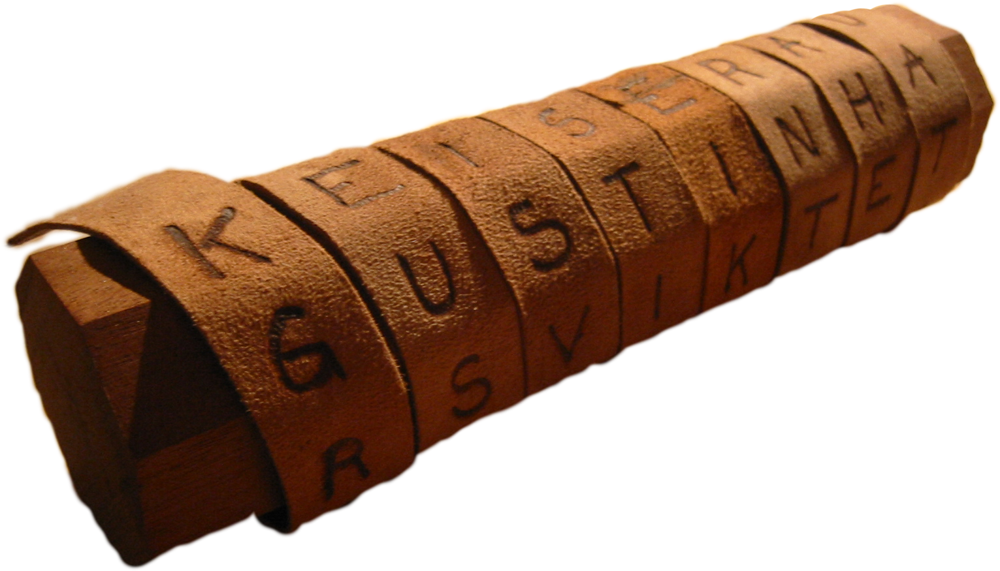

> [!success] Lernziele
> 
> - Sie können die Grundbegriffe **Klartext, Ciphertext und Schlüssel** unterscheiden.
> - Sie kennen das **Kerckhoffs**-Prinzip.
> - Sie können einen Text mit den klassischen Verschlüsselungsverfahren Scytale, Caesar und Vigenère verschlüsseln und wieder entschlüsseln.


> [!example] Praktischer Einstieg
> 
> Setzten Sie sich in Gruppen zusammen. Sie sind alles Spione eines Geheimdienstes und müssen eine Methode entwickeln, wie Sie **Nachrichten ver- und entschlüsseln** können. Aber Achtung! Ihre Nachrichten können in die falschen Hände geraten. Schaffen Sie es eine Methode zu finden, die **die gegnerischen Geheimdienste nicht knacken können**? 
> 
> Sie haben 20 Minuten Zeit für folgende Aufgaben:
> - Einigen Sie sich auf eine **Methode**
> - **Verschlüsseln** Sie eine hochgeheime Nachricht, die mindestens 3 Sätze einhaltet und ein **Treffen** vereinbart.
> - Testen Sie vielleicht, dass Sie die Nachricht auch wieder fehlerfrei **entschlüsseln** könnten.
> 
> ...dann passiert der Super-GAU!
> 
> (Musik fürs [Ambiente](https://open.spotify.com/track/4y8GgkINBu7hH7IX9CBw87?si=16e17ac2221e4b06))

Weite Teile des modernen Internets basieren auf demselben Prinzip: dass **Nachrichten geheim übertragen werden** können. 

Wir nähern uns hier diesem Thema an und schauen, wie wir mit Python eine eigene Verschlüsselungsfunktion schreiben können. Wir nutzen folgende Begriffe:
- **Klartext / Plaintext**: Die Information, die wir verschlüsseln.
- **Chiffretext / Ciphertext**: Die verschlüsselte Zeichenkette
- **Schlüssel**: Was man wissen muss, um den Geheimtext in den Klartext umzuwandeln.

Ein grundlegendes Prinzip der modernen Kryptografie, das nach dem niederländischen Kryptologen Auguste **Kerckhoffs** benannt ist. Es wurde in den 1880er Jahren formuliert und lautet im Wesentlichen: *"Ein kryptografisches System sollte auch dann sicher sein, wenn alles darüber bekannt ist, ausser dem geheimen Schlüssel."*
## Scytale-Verschlüsselung

Die Scytale-Verschlüsselung ist eine der ältesten bekannten Verschlüsselungsmethoden und wurde im antiken Griechenland verwendet. Sie ist eine Form der **Transpositionsverschlüsselung**, bei der die Positionen der Zeichen im Klartext verändert werden, ohne die Zeichen selbst zu verändern.
## Funktionsweise


- **Klartext**: "diesisteinegeheimenachricht"
- **Anzahl der Spalten**: 5

**Schritt-für-Schritt-Verfahren**:
1. Schreibe die Nachricht zeilenweise:
   ```
   d i e s i
   s t e i n
   e g e h e
   i m e n a
   c h r i c
   h t
   ```

2. Lies die Zeichen spaltenweise ab, um den verschlüsselten Text zu erhalten (Abstände dienen bloss der einfachen Lesbarkeit - natürlich würde man die weglassen!):
   ```
   Verschlüsselte Nachricht: "dseich itgmht eeeer sihni ineac"
   ```
## Nachteile
  - Anzahl Spalten ist konstant
  - Einige Aspekte sind offen erkennbar:
	  - Erster Buchstabe
	  - Länge der Nachricht
	  - Buchstaben stimmen
## Caesar-Verschlüsselung

Die Caesar-Verschlüsselung ist eine der einfachsten und bekanntesten Methoden der klassischen Kryptografie. Sie wurde nach Julius Caesar benannt, der diese Methode angeblich verwendet hat, um seine militärischen Nachrichten zu verschlüsseln. 

Die Caesar-Verschlüsselung ist eine sogenannte **monoalphabetische Substitution**. Das bedeutet, dass jeder Buchstabe des Klartextes durch einen anderen Buchstaben des Alphabets ersetzt wird.
## Funktionsweise

![[crypto-01-klassisch-caesarshift.excalidraw]]

- **Klartext**: "HELLO"
- **Schlüssel**: 3
- **Verschlüsselter Text**: "KHOOR"

Hierbei wird jeder Buchstabe des Klartextes um drei Positionen im Alphabet verschoben. Am Ende des Alphabets wird zyklisch wieder von vorne begonnen (<span class="text-blue-500">Blauer Pfeil als Beispiel</span>). 

Das lässt sich mit dem **Rest (Modulo) von einer Division durch 26 umsetzen**. Also mathematisch $(n+3) \bmod 26$, oder in Python `(n + 3) % 26`.

## Nachteile
  - Verschiebung ist konstant
  - Länge der Nachricht ist offen erkennbar
  - Mit nur 25 möglichen Verschiebungen (bei einem Alphabet von 26 Buchstaben) kann ein Angreifer alle möglichen Schlüssel ausprobieren (Brute-Force-Angriff)
  - Anfällig auf Häufigkeitsanalyse
## Vigenère-Verschlüsselung

Die Vigenère-Verschlüsselung ist eine weiterentwickelte Form der monoalphabetischen Substitution und stellt eine **polyalphabetische Substitution** dar. Sie wurde nach Blaise de Vigenère benannt und ist deutlich sicherer als die Caesar-Verschlüsselung, da sie mehrere Caesar-Verschiebungen kombiniert.
## Funktionsweise

- **Klartext**: "HELLO"
- **Schlüsselwort**: "KEY"
- **Schlüsselwort erweitert**: "KEYKE"
- **Verschlüsselter Text**: "RIJVS"

Hierbei wird jeder Buchstabe des Klartextes unterschiedlich verschoben:

- `H` (Shift 10) -> `R`
- `E` (Shift 4) -> `I`
- `L` (Shift 24) -> `J`
- `L` (Shift 10) -> `V`
- `O` (Shift 4) -> `S`

![[crypto-01-klassisch-vigenere-tabularecta.excalidraw]]

