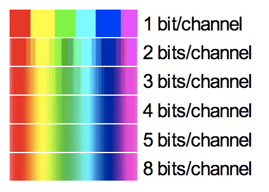

## Farben in RGB

Gratulation! Jetzt haben Sie das Rüstzeugs, ein grundlegendes Konzept zu verstehen, das Sie täglich umgibt: **Farben und Farbmodelle**!

Wenn Sie Ihren Bildschirm aus der Nähe anschauen, merken Sie, dass sie aus kleinen, farbig leuchtenden Stellen bestehen. Hier eine Nahaufnahme von Wikipedia:

![[pixel-rgb.excalidraw]]

Wie LCDs genau farbiges Licht erzeugen ist sehr interessant! Falls Sie das interessiert, hier [ein Youtube-Video dazu](https://youtu.be/gA2mG6MieV8?si=lFMIjN2Eh-RKs_lO&t=155). Aber Sie können die Informatik problemlos verstehen, ohne die Physik davon überhaupt anzuschauen.

Diese "Lämpchen" sind **rot**, dann **grün**, dann **blau**, und dann wieder rot, grün, blau, und so weiter. Ein Dreierpack aus einem roten, grünen und blauen "Lämpchen" ist ein RGB-Pixel. 

RGB-Pixel haben also mindestens folgende Charakteristiken:
- Werte für Rot, Grün, Blau
- Koordinaten

### Farbtiefe

Stellen Sie sich mal vor, wir könnten diese RGB-Lämpchen einfach nur ganz ein- oder ausschalten. Wie viele Mischfarben könnten wir erzeugen?
> [!solution]- Lösung
> 
> Um es sich einfach zu machen, können Sie sich in diesem Beispiel einen RGB-Pixel als eine einzelne Binärzahl vorstellen.
> 
> - 0002 wäre schwarz.
> - 0012 wäre blau.
> - 0102 wäre grün.
> - 0112 wäre die Mischung aus grün und blau, also hellblau. 
> 	⋮
> - 1112 wäre die Mischung aller Farben, also weiss.
> 
> Wie viele Kombinationen gibt es also? 1112 sind 710, aber da wird 0002 (Schwarz) nicht mitgezählt. Zusammen mit Schwarz gibt es **8 Farbkombinationen, also 23**. 
> 
> Ohne Weiss und Schwarz sähe der Regenbogen dann so aus:
> 
> 

Typischerweise reicht die Werte für Rot, Grün und Blau von 0 bis **255**... Diese Zahl sollte Ihnen bekannt vorkommen. 
- Was sagt Ihnen das über die **Datenstruktur** aus? 
- Wie viele **Mischfarben** können Sie daraus erzeugen?

> [!solution]- Lösung
> 
> 255 ist die höchste Zahl, die Sie in einem Byte (also 8 Bit) speichern können. Das heisst: Jeder Farbkanal hat pro Pixel 8 Bit zu Verfügung, um eine Zahl zu speichern.
> 
> Als wir noch 1 Bit pro Kanal hatten, hatten wir pro Kanal 2 Zustände (21) und deswegen 23 Farbkombinationen. Daraus erschliesst sich: 
> 
> Farbkombinationen = Zustände pro KanalAnzahl Kanäle
> 
> Jetzt haben wir pro Kanal 28 = 256 Zustände pro Kanal (inkl. Null!). Bei drei Kanälen haben wir also 2563 Kombinationen. Das gibt: 16'777'216 Farben!

Sie sehen also: Je nachdem wie viel Informationen Sie pro Farbkanal haben, desto mehr Mischfarben können Sie erzeugen. Das nennt man die Farbtiefe, die typischerweise in Bit angegeben wird ("8 bits/channel" = eine Farbtiefe von 8 Bit).

Wieso Farb*tiefe*? Weil Sie sich ein Bild nun als Quader vorstellen können.
- Die Anzahl Pixel in der Breite ist die Breite.
- Die Anzahl Pixel in der Höhe ist die Höhe.
- Die Farbtiefe × Anzahl Kanäle ist die Tiefe.

Die Datenmenge, die Sie benötigen, um das Bild zu speichern, ist dann einfach das Volumen des Quaders.

Wenn Sie wenig Farbtiefe haben, haben Sie wenig Mischfarben, aber auch weniger Daten. Ich habe Ihnen das hier zu visualisieren versucht. 
- Links haben Sie 1 Bit Farbtiefe - und deswegen nur wenige Farben. 
- Rechts haben Sie 4 Bit Farbtiefe - und deswegen sehen Sie mehr Farbschattierungen, aber haben auch einen grösseren Block von Daten.

Im Webdesign werden eben diese Ideen verwendet, um Farben zu mischen. Verändern Sie mal die Hintergrundfarbe des Informatikgartens und versuchen Sie, die Farbnotation mit Hashtag "#" zu verstehen!

<ColorSliders />

### Aufgabe zu Farbtiefe & Datenmenge

Wie viele Bytes an Daten brauchen Sie, wenn Sie ein unkomprimiertes RGB-Bild von 1000 Pixel Breite, 1000 Pixel Höhe und mit 8 Bit Farbtiefe speichern wollen?

> [!info] Zusammenfassung
> 
> ## Theorie: Pixel & Farbtiefe
> 
> Bei Bildern ist die kleinste Einheit ein Pixel. Ein Pixel besteht typischerweise aus:
> - Einer Zahl pro Farbkanal (drei bei RGB, eine bei Graustufe)
> - Zwei Koordinaten für x und y
> 
> Ein RGB-Bild mit 8 Bit Farbtiefe pro Farbkanal kann rund 16,8 Millionen Farben mischen, weil:
> - 8-Bit pro Kanal ⇒
> - 256 verschiedene Zustände pro Kanal ⇒ 
> - 2563 Kombinationen insgesamt ⇒
> - 16,8 Millionen Kombinationen
> 
> ![[05-farben-formel.excalidraw]]
> 
> 8-Bit-RGB wird typischerweise dezimal oder hexadezimal notiert. Ein schönes Orange wäre z.B.: 
> - `rgb(255, 64, 16)`
> - `#ff4010`
> 
> Das ist zweimal die gleiche Farbe, weil:
> - Rot: 25510 = ff16
> - Grün: 6410 = 4016
> - Blau: 1610 = 1016

