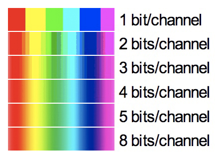

> [!success] Lernziele
> 
> - Sie können **additive und subtraktive Farbmodelle** erklären und zwei Beispiele nennen.
> - Sie wissen, wie Displays mit Pixeln und dem RGB-Farbmodell **Farben mischen**.
> - Sie können **berechnen, wie viele unterschiedliche Farben** bei verschiedenen Farbtiefen und Anzahl Farbkanälen darstellbar sind.

## Farben mischen - aber durch Subtraktion oder Addition?

Die meisten natürlichen Objekte der Welt produzieren selbst kein Licht - sie leuchten nicht. Stattdessen absorbieren sie bestimmte Wellenlängen des auftreffenden Lichts und reflektieren andere. Ein rotes Objekt absorbiert beispielsweise grünes und blaues Licht, reflektiert aber rotes Licht zurück zu unseren Augen. 

![[05-farben-farbmodelle-physik-sub.excalidraw.light.svg]]

Dieses Prinzip nennt man das **subtraktive Farbmodell** - je mehr Farben gemischt werden, desto dunkler wird das Ergebnis, weil mehr und mehr Lichtfarben absorbiert werden. Kurz zusammengefasst: **Beim Mischen werden Farben voneinander subtrahiert**.

Das Gegenteil dazu ist das **additive Farbmodell**, wie es bei Bildschirmen oder farbigen Scheinwerfern verwendet wird. Das Licht selbst ist von Anfang an farbig, und wenn man verschiedenfarbige Lichter miteinander mischt, werden die Farben heller, weil mehr und mehr Lichtfarben hinzugefügt werden. **Beim Mischen werden also Farben zueinander addiert**.

![[05-farben-farbmodelle-mischen-add.excalidraw.light.svg]]

Das gängigste additive Farbmodell ist Rot-Grün-Blau (**RGB**). 
- Addiert man Rot und Grün, sehen wir Gelb.
- Addiert man Grün und Blau, sehen wir Cyan.
- Addiert man Blau und Rot, sehen wir Magenta.

Beachten Sie: Alle wahrgenommenen Mischfarben sind heller als die Ausgangsfarben.

![[05-farben-farbmodelle-mischfarben.excalidraw.light.svg]]

Das gängigste subtraktive Farbmodell ist Cyan-Magenta-Gelb-Schwarz (**CMYK**).
- Mischt man Cyan und Magenta, sehen wir Blau.
- Mischt man Magenta und Gelb, sehen wir Rot.
- Mischt man Gelb und Cyan, sehen wir Grün.

Beachten Sie: Alle wahrgenommenen Mischfarben sind dunkler als die Ausgangsfarben.

Im Folgenden schauen wir uns an, wie RGB-Farben auf Ihrem Bildschirm gemischt werden.

## Farben in RGB

Gratulation! Jetzt haben Sie das Rüstzeug, um zu verstehen, wie die Bildschirme, die Sie täglich verwenden, Farben erzeugen - und Sie werden bald sogar ausrechnen können, wie viele Farben sie theoretisch erzeugen können! 

Wenn Sie Ihren Bildschirm aus der Nähe anschauen, merken Sie, dass er aus kleinen, farbig leuchtenden Stellen besteht. Hier eine Nahaufnahme von Wikipedia:

![[pixel-rgb.excalidraw]]

Wie LCDs genau farbiges Licht erzeugen ist sehr interessant! Falls Sie das interessiert, hier [ein Youtube-Video dazu](https://youtu.be/gA2mG6MieV8?si=lFMIjN2Eh-RKs_lO&t=155). Aber Sie können die Informatik problemlos verstehen, ohne die Physik davon überhaupt anzuschauen.

Diese "Lämpchen" sind **rot**, dann **grün**, dann **blau**, und dann wieder rot, grün, blau, und so weiter. Ein Dreierpack aus einem roten, grünen und blauen "Lämpchen" ist ein Pixel. 

Pixel haben also mindestens folgende Charakteristiken:
- Werte für Rot, Grün, Blau
- Koordinaten

### Farbtiefe

Stellen Sie sich mal vor, wir könnten diese RGB-"Lämpchen" einfach nur ganz ein- oder ausschalten. Wie viele Mischfarben könnten wir erzeugen?

> [!solution]- Lösung
> 
> Um es sich einfach zu machen, können Sie sich in diesem Beispiel einen RGB-Pixel als eine einzelne Binärzahl vorstellen.
> 
> - 0002 wäre schwarz.
> - 0012 wäre blau.
> - 0102 wäre grün.
> - 0112 wäre die Mischung aus grün und blau, also hellblau. 
> 	⋮
> - 1112 wäre die Mischung aller Farben, also weiss.
> 
> Wie viele Kombinationen gibt es also? 1112 sind 710, aber da wird 0002 (Schwarz) nicht mitgezählt. Zusammen mit Schwarz gibt es **8 Farbkombinationen**.
>
> Das könnten Sie sich auch direkt herleiten: Jede der drei Farben (Rot, Grün, Blau) kann entweder an oder aus sein, also gibt es $2 \times 2 \times 2 = 2^3 = 8$ Kombinationen.
>
> Ohne Weiss und Schwarz sähe der Regenbogen dann so aus:
> 
> 

Typischerweise reicht die Werte für Rot, Grün und Blau von 0 bis **255**... Diese Zahl sollte Ihnen bekannt vorkommen. 
- Was sagt Ihnen das über die **Datenstruktur** aus? 
- Wie viele **Mischfarben** können Sie daraus erzeugen?

> [!solution]- Lösung
> 
> 255 ist die höchste Zahl, die Sie in einem Byte (also 8 Bit) speichern können. Das heisst: Jeder Farbkanal hat pro Pixel 8 Bit zur Verfügung, um eine Zahl zu speichern.
> 
> **Herleitung der Berechnung:**
> 
> 1. **Pro Farbkanal:** 8 Bit ergeben 28 = 256 verschiedene Werte (0 bis 255)
> 2. **Anzahl Farbkanäle:** RGB hat 3 Kanäle (Rot, Grün, Blau)
> 3. **Gesamtkombinationen:** Da jeder Kanal unabhängig von den anderen jeden seiner Werte annehmen kann, multiplizieren sich die Möglichkeiten:
> 
> **Formel:** $\text{Anzahl Farben} = (2^{\text{Bit pro Kanal}})^{\text{Anzahl Farbkanäle}}$
> 
> **Eingesetzt:** $\text{Anzahl Farben} = (2^8)^3 = 256^3 = 256 \times 256 \times 256 = \mathbf{16'777'216}$ **Farben**
> 
> **Vergleich:** Als wir nur 1 Bit pro Kanal hatten, ergaben sich $(2^1)^3 = 2^3 = 8$ Farbkombinationen.

Sie sehen also: Je nachdem wie viel Informationen Sie pro Farbkanal haben, desto mehr Mischfarben können Sie erzeugen. Das nennt man die Farbtiefe, die typischerweise in Bit angegeben wird ("8 bits/channel" = eine Farbtiefe von 8 Bit).

Im Webdesign werden eben diese Ideen verwendet, um Farben zu mischen. Verändern Sie mal die Hintergrundfarbe des Informatikgartens und versuchen Sie, die Farbnotation mit Hashtag "#" zu verstehen!

<ColorSliders />

### Aufgabe zu Farbtiefe & Datenmenge

Wie viele Bytes an Daten brauchen Sie, wenn Sie ein unkomprimiertes RGB-Bild von 1000 Pixel Breite, 1000 Pixel Höhe und mit 8 Bit Farbtiefe speichern wollen?

> [!info] Zusammenfassung
> 
> ## Theorie: Pixel & Farbtiefe
> 
> Bei Bildern ist die kleinste Einheit ein Pixel. Ein Pixel besteht typischerweise aus:
> - Einer Zahl pro Farbkanal (drei bei RGB, eine bei Graustufe)
> - Zwei Koordinaten für x und y
> 
> Ein RGB-Bild mit 8 Bit Farbtiefe pro Farbkanal kann rund 16,8 Millionen Farben mischen, weil:
> - 8-Bit pro Kanal ⇒
> - 256 verschiedene Zustände pro Kanal ⇒ 
> - 2563 Kombinationen insgesamt ⇒
> - 16,8 Millionen Kombinationen
> 
> ![[05-farben-formel.excalidraw]]
> 
> 8-Bit-RGB wird typischerweise dezimal oder hexadezimal notiert. Ein schönes Orange wäre z.B.: 
> - `rgb(255, 64, 16)`
> - `#ff4010`
> 
> Das ist zweimal die gleiche Farbe, weil:
> - Rot: 25510 = ff16
> - Grün: 6410 = 4016
> - Blau: 1610 = 1016

