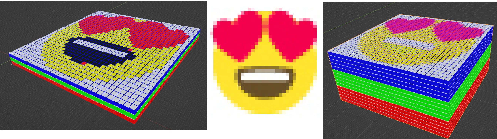
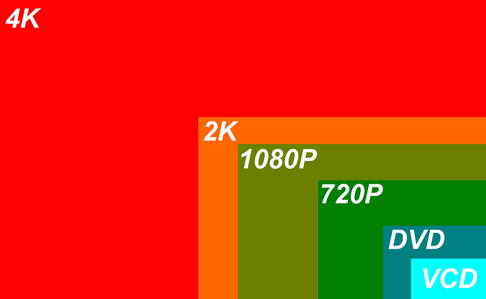
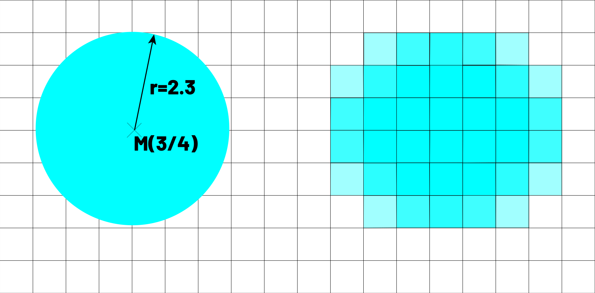
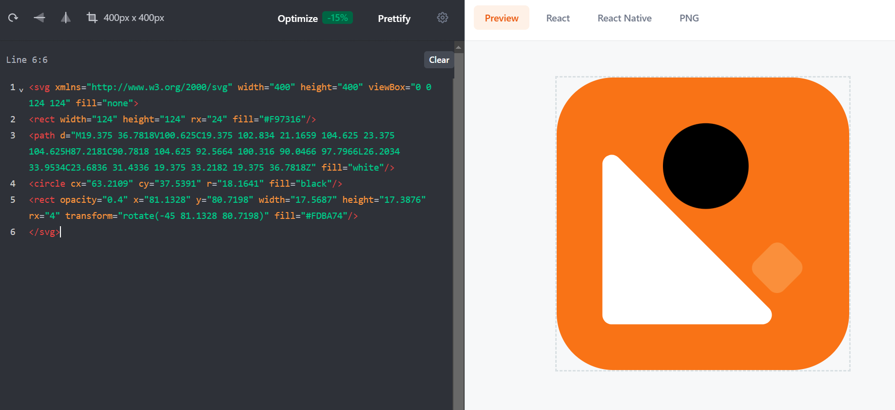

> [!success]  Lernziele
> 
> *Hinweis: Wir behandeln keine Umwandlungen, die grösser als zwei Byte oder 65'535<sub>10</sub> sind.*
> 
> - Sie können berechnen, wie viel Speicherplatz theoretisch für ein unkomprimiertes RGB-Bild mit einer gewissen Auflösung und Farbtiefe nötig wäre.
> - Sie wissen, wie sich die Berechnung verändert, wenn es ein Graustufen-Bild ist.
> - Sie können die Prinzipien einer Rastergrafik und einer Vektorgrafik voneinander unterscheiden.
> - Sie verstehen die Inhalte des Theorieeintrags.

Stellen Sie sich vor: Bits könnten in Ihrem Speicher könnten ja direkt einzelne Farben sein. 0 wäre schwarz, 1 wäre weiss. 

Ein Smiley könnte dann so aussehen:

![[Pasted-image-20231127063226.png]]

Das ist eine sogenannte **Rastergrafik**. Die Grafik ist einfach eine Tabelle, bei der die Zellen mit Farben gefüllt werden.

Die **unkomprimierte Datenmenge** zu bestimmen, ist bei diesem Beispiel relativ einfach: Sie brauchen pro Pixel ein Bit. Pro Reihe des Bildes brauchen Sie also zwei Byte. Weil es 16 Reihen hat, bräuchten wir also insgesamt 32 Byte (= 256 Bit) Speicherplatz. Die Rechnung wäre also:

$\text{Breite} \times \text{Höhe} \times \text{Datenmenge pro Pixel}$

## "Farbtiefe" geometrisch verstehen

Aber natürlich wollen wir mehr Farben! Dafür nutzen wir die Idee des RGB-Farbmodells der letzten Lektion und mischen uns die Farben. Erinnern wir uns: Wir haben uns überlegt, wie viele Farben man mischen könnte, wenn man für Rot, Grün und Blau je 8 Bit zur Verfügung hätte.
![[05-farben-formel.excalidraw]]
Jetzt mit den Bildern haben wir alles beisammen, um zu verstehen, wieso man bei der Datenmenge pro Pixel von der **Farbtiefe** spricht. Das hat den einfachen Grund, dass Sie sich die Datenmenge eines Bildes **geometrisch als Quader vorstellen** können. Dann wäre die Farbtiefe nämlich die **dritte Dimension des Bildes** - halt eben die Tiefe.

- Die Anzahl Pixel in der Breite ist die Breite.
- Die Anzahl Pixel in der Höhe ist die Höhe.
- Die Datenmenge pro Pixel für die Farben ist die Tiefe des Quaders.
- Die Datenmenge des ganzen Bildes ist dann $\text{Breite} \times \text{Höhe} \times \text{Tiefe}$ - also das **Volumen des Quaders**. 

Ich habe Ihnen das in Blender visualisiert: Jeder kleine Würfel entspricht einem Bit.
- Links haben wir 1 Bit Farbtiefe. Das Datenquader ist 3 Bit hoch und wir haben nur sehr wenige Mischfarben (nämlich $2^3 = 8$). 
- Rechts haben Sie 4 Bit Farbtiefe. Das Datenquader wird jetzt 12 Bit hoch, aber dafür sehen Sie mehr Farbschattierungen, weil wir mehr Farben mischen können.


> [!example] Diskutieren Sie
> 
> Ich habe Ihnen die gleiche Idee interaktiv programmiert. Als Originalbild (rechts) sehen Sie hier ein RGB-Bild mit 64 x 64 Pixeln und 2 Bit Farbtiefe. Sie können mit den Reglern die Auflösung (damit meint man die Breite und Höhe) sowie die Farbtiefe verändern. Zudem sehen Sie eine 3D-Visualisierung des Datenquaders. Spielen Sie mit den Reglern, um ein Gefühl für die Effekte der Regler zu erhalten. 
> 
> Überlegen Sie sich folgende Fragen:
> 1. Welche Regler machen das Bild schärfer?
> 2. Welcher Regler gibt Ihnen mehr Farben?
> 3. Was passiert mit der Datenmenge, wenn Sie ein qualitativ hochwertiges Bild wollen?
> 4. Was verkörpert die Datenmenge, die nötig ist, um das Bild zu speichern?
> 5. Wie könnten Sie diese Datenmenge berechnen?

```codepen hash=VwgdRrG height=500px
```


> [!example] Diskutieren Sie
> 
> Nun haben Sie das Rüstzeug, um sich folgende Fragen zu überlegen:
> 1.  Sie finden zwei Versionen eines Videos: Einmal in *FullHD* und 4 Bit Farbtiefe, und einmal in *4K* mit 8 Bit Farbtiefe (recherchieren Sie die Begriffe selbst). Wie viel länger wird der Download gehen?
> 2. Sie kaufen eine professionelle Kamera mit 24 Megapixeln und 12 Bit Farbtiefe pro Farbkanal. Zudem hat die Kamera eine Funktion, um die Bilder "roh" unkomprimiert zu speichern. Wie viel Speicher bräuchte so das grösst mögliche Bild (in Megabyte)? 
> 3. Wie viel mehr Farben kann die Kamera mit 12 Bit Farbtiefe mischen im Vergleich zu den weitverbreiteten Formaten mit 8 Bit Farbtiefe?
> 4. Wie würde sich die Datenmenge verändern, wenn Sie keine Farben hätten sondern nur Graustufen?

> [!solution]- Lösung zu den Fragen
> 
> 1. Das **Volumen** des Quaders ist die Datenmenge.
> 2. Grundsätzlich:
> $$Breite \times \text{H\"ohe} \times Tiefe$$
> In unserem Fall also:
> $$Pixelbreite \times \text{Pixelh\"ohe} \times ( \text{Farbtiefe pro Kanal} \times \text{Anzahl Farbkan\"ale} )$$
> Oder:
> $$Pixelbreite \times \text{Pixelh\"ohe} \times ( \text{Farbtiefe insgesamt} )$$
> Dass es keine Verwechslung gibt, präzisiert man die Farbtiefe teils mit "bits per channel" (bpc) oder "bits per pixel" (bpp). 8 bpc sind bei RGB 24 bpp.
> 3. **FullHD** (oder "1080p" genannt) ist 1920x1080 Pixel. **4K** ist 3840x2160 Pixel.
> 
> 4K ist also eine viermal grössere Fläche als FullHD. Wenn Sie nun auch noch eine doppelt so grosse Farbtiefe haben, haben Sie also **achtmal mehr Daten**, die Sie herunterladen müssen. (Stellen Sie sich das als Datenquader vor!)
> 4. Rechnen wir von Beginn an in Byte, das ist einfacher. Pro Farbkanal und Pixel haben wir 12 Bit, also 1,5 Byte pro Farbe und Pixel. Mit drei Farben sind das 4,5 Byte pro Pixel. Zudem haben wir 24 Megapixel - also 24 Millionen Pixel!
> 	$$4,5 \text{ Byte} \times 24 \text{ Megapixel}$$
> 	Das macht **108 Megabyte** für ein Bild!
> 5. Erinnern Sie sich an die Formel für die Anzahl Mischfarben bei 8 Bit Farbtiefe.
> 	![[05-farben-formel.excalidraw]]
> 	Wir müssen nun die Anzahl Farben der Kamera und die Farben bei 8 Bit ins Verhältnis setzen:
> 	$$
> 	\frac{(2^{12})^3}{(2^8)^3} = \frac{2^{36}}{2^{24}} = 2^{36-24} = 2^{12} = 4096
> 	$$
> 	Das bedeutet: Die 12-Bit-Kamera kann 4096-mal mehr Farben mischen als ein normaler Computer! Anstatt "nur" 16,8 Millionen Farben haben Sie **68,7 Milliarden Farben**.
> 6. Ein Bild aus Graustufen hat einfach einen Kanal anstatt drei Kanäle pro Farbe. Das heisst: Die unkomprimierte Datenmenge ist ein Drittel der Datenmenge von RGB.

## Vektorgrafiken

Wir haben bislang von Rastergrafiken gesprochen, die ein Bild in Pixel aufteilen. Der andere Haupttyp von Grafiken sind die sogenannten **Vektorgrafiken**.

Anders als Rastergrafiken beschreiben Vektorgrafiken die Inhalte mathematisch als geometrische Formen. Ein Beispiel eines Kreises, bei dem Rastergrafik denkbar schlecht wegkommen:



> [!example] Editieren Sie eine SVG-Grafik
> 
> Gehen Sie zu [svgviewer.dev](https://www.svgviewer.dev/). Dort sehen Sie standardmässig dieses Logo, das vom SVG-Code links kreiert wird.
> 
> 
> 
> Versuchen Sie folgende Veränderungen selbst vorzunehmen.
> 
> 1. Vergrössern Sie den Kreis.
> 2. Geben Sie dem Kreis ein passendes Gelb oder Hellorange.
> 3. Verschieben Sie den Kreis weiter rechts.
> 4. Fügen Sie einen zweiten, grünen Kreis hinzu.
> 5. Machen Sie das gerundete Quadrat im Hintergrund blau.
> 6. Können Sie sich einen Sinn darauf reimen, wie die Form des gerundeten Quadrats gespeichert ist?
> 
> Installieren Sie das Open-Source-Programm [Inkscape](https://inkscape.org/).
> 7. Speichern Sie sich Ihr SVG von svgviewer.dev als normale Textdatei.
> 8. Ändern Sie die Dateiendung auf `.svg`.
> 9. Öffnen Sie die svg-Datei in Inkscape. Jetzt können Sie die Vektorgrafik visuell bearbeiten!
> 10. Nochmal: Wie wird die Form des gerundeten Quadrats gespeichert?


> [!example] Diskutieren Sie 
> 
> Was sind wohl die Vor- und Nachteile der beiden Grafiktypen? Hier einige Bilder als Inspiration:
> 
> 
> 
> 
> 
> ```renderhtml
> ---html
> <div class="container">
>     <a class="button is-play" href="#">
>         <div class="button-outer-circle has-scale-animation"></div>
>         <div class="button-outer-circle has-scale-animation has-delay-short"></div>
>         <div class="button-icon is-play"><svg height="100%" width="100%" fill="#f857a6"><polygon class="triangle" points="5,0 30,15 5,30" viewBox="0 0 30 15"></polygon><path class="path" d="M5,0 L30,15 L5,30z" fill="none" stroke="#f857a6" stroke-width="1"></path></svg></div>
>     </a>
> </div>
> ---css
> .container {
>   display: flex;
>   justify-content: center;
>   align-items: center;
>   padding: 50px 0;
>   width: 100%;
> }
> .button {
>   display: inline-block;
>   position: relative;
> }
> .button.is-play {
>   background-color: #fff;
>   border-radius: 50%;
>   width: 100px;
>   height: 100px;
> }
> .button.is-play .button-outer-circle {
>   background: rgba(255,255,255,0.2);
>   border-radius: 50%;
>   position: absolute;
>   top: 0;
>   left: 0;
>   right: 0;
>   bottom: 0;
>   height: 100%;
>   width: 100%;
> }
> .button.is-play .button-icon {
>   position: absolute;
>   top: 50%;
>   left: 50%;
>   width: 30px;
>   height: 30px;
>   transform: translate(-50%, -50%);
> }
> .button.is-play .button-icon .triangle {
>   animation: fadeIn 7s ease;
> }
> .button.is-play .button-icon .path {
>   stroke-dasharray: 90;
>   stroke-dashoffset: 0;
>   animation: triangleStroke 3s;
>   animation-timing-function: ease;
> }
> .has-scale-animation {
>   animation: smallScale 3s infinite;
> }
> .has-delay-short {
>   animation-delay: 0.5s;
> }
> @-moz-keyframes fadeIn {
>   from {
>     opacity: 0;
>   }
>   to {
>     opacity: 1;
>   }
> }
> @-webkit-keyframes fadeIn {
>   from {
>     opacity: 0;
>   }
>   to {
>     opacity: 1;
>   }
> }
> @-o-keyframes fadeIn {
>   from {
>     opacity: 0;
>   }
>   to {
>     opacity: 1;
>   }
> }
> @keyframes fadeIn {
>   from {
>     opacity: 0;
>   }
>   to {
>     opacity: 1;
>   }
> }
> @-moz-keyframes triangleStroke {
>   from {
>     stroke-dashoffset: 90;
>   }
>   to {
>     stroke-dashoffset: 0;
>   }
> }
> @-webkit-keyframes triangleStroke {
>   from {
>     stroke-dashoffset: 90;
>   }
>   to {
>     stroke-dashoffset: 0;
>   }
> }
> @-o-keyframes triangleStroke {
>   from {
>     stroke-dashoffset: 90;
>   }
>   to {
>     stroke-dashoffset: 0;
>   }
> }
> @keyframes triangleStroke {
>   from {
>     stroke-dashoffset: 90;
>   }
>   to {
>     stroke-dashoffset: 0;
>   }
> }
> @-moz-keyframes smallScale {
>   from {
>     transform: scale(1);
>     opacity: 1;
>   }
>   to {
>     transform: scale(1.5);
>     opacity: 0;
>   }
> }
> @-webkit-keyframes smallScale {
>   from {
>     transform: scale(1);
>     opacity: 1;
>   }
>   to {
>     transform: scale(1.5);
>     opacity: 0;
>   }
> }
> @-o-keyframes smallScale {
>   from {
>     transform: scale(1);
>     opacity: 1;
>   }
>   to {
>     transform: scale(1.5);
>     opacity: 0;
>   }
> }
> @keyframes smallScale {
>   from {
>     transform: scale(1);
>     opacity: 1;
>   }
>   to {
>     transform: scale(1.5);
>     opacity: 0;
>   }
> }
> ```

> [!question]- Mögliche Gedanken zur Diskussion
> 
> ### Auflösung
> Einer der Hauptunterschiede zwischen Raster- und Vektordateien ist deren Auflösung. Die Auflösung einer **Rasterdatei** wird in DPI (dots per inch) oder PPI (pixels per inch) angegeben. Wenn man in eine Rastergrafik hineinzoomt oder ihre Grösse vergrössert, beginnt man, die einzelnen Pixel zu erkennen.
> 
> **Rasterdateien** nutzen meist mehr Farben, ermöglichen eine umfangreichere Farbbearbeitung und zeigen feinere Licht- und Schatteneffekte als Vektoren – verlieren jedoch an Bildqualität, wenn sie in der Grösse verändert werden. Ein einfacher Weg, um festzustellen, ob ein Bild eine Raster- oder Vektorgrafik ist, besteht darin, es zu vergrössern. Wenn das Bild unscharf oder pixelig wird, handelt es sich wahrscheinlich um eine Rasterdatei.
> 
> Für **Vektorbilder** ist die Auflösung kein Problem. Man kann Vektoren unendlich skalieren, umformen und anpassen, ohne an Bildqualität zu verlieren. Vektordateien sind beliebt für Bilder, die in einer Vielzahl von Grössen erscheinen müssen, wie z.B. ein Logo, das sowohl auf einer Visitenkarte als auch auf einem Plakat passen muss.
> 
> ### Verwendungszwecke
> Digitale Fotos sind Rasterdateien. Viele Digitalkameras schiessen automatisch Fotos und speichern sie als Rasterdateien – und die Bilder, die man online sieht, sind oft auch Rastergrafiken. Rasterdateien werden auch häufig für die Bearbeitung von Bildern, Fotos und Grafiken verwendet.
> 
> **Vektordateien** eignen sich besser für digitale Illustrationen, komplexe Grafiken und Logos. Das liegt daran, dass die Auflösung von Vektoren beim Skalieren gleich bleibt, was sie für eine Vielzahl von Druckformaten geeignet macht. Das Vektorformat SVG ist ein etablierter Web-Standard und wird auf Webseiten oft gebraucht, um kleine Symbole zu animieren (z.B. der Play-Knopf auf Youtube).
> 
> Manche Dateitypen können sowohl Raster- als auch Vektorbilder kombinieren - allen voran PDFs und Word-Dateien. Zum Beispiel könnte eine Broschüre Vektorgrafiken für das Firmenlogo und den Text verwenden, aber Rasterdateien für die Fotografie.
> 
> ### Dateigrössen
> **Rasterdateien** sind im Allgemeinen grösser als Vektordateien. Sie können Millionen von Pixeln und unglaublich hohe Detailstufen enthalten. Ihre Grösse kann den Speicherplatz von Geräten beeinträchtigen und das Laden von Seiten im Web verlangsamen. Allerdings kann man Rasterdateien komprimieren, um sie für die Speicherung und Web-Optimierung zu optimieren, oder um das Teilen schneller und einfacher zu machen.
> 
> **Vektordateien** brauchen weniger Speicherplatz als Rasterdateien und enthalten nur die mathematischen Formeln, die das Design bestimmen.
> 
> ### Kompatibilität und Konvertierung
> **Rasterdateien** können in vielen verschiedenen Apps und Webbrowsern geöffnet werden, was sie leicht zu betrachten, bearbeiten und teilen macht. Bis auf SVG sind viele andere **Vektordateien** nicht so zugänglich. PDF, AI, oder EPS erfordern spezialisierte Software, um die Dateien zu öffnen und zu bearbeiten.
> 
> ### Datei- und Erweiterungstypen
> Die verwendete Software bestimmt in der Regel den Dateityp, ob Raster oder Vektor. Es gibt mehrere Typen und Erweiterungen von sowohl Raster- als auch Vektordateien, jede mit ihren eigenen Merkmalen.
> 
> | Dateityp | Format | Verwendung                   | Besonderheiten                                              |
> |----------|--------|------------------------------|-------------------------------------------------------------|
> | Raster   | JPEG   | Fotos, Web                   | Hohe Kompression, Verlust an Bildqualität                   |
> | Raster   | PNG    | Web, Transparenz             | Unterstützt Transparenz, verlustfreie Kompression           |
> | Raster   | GIF    | Animationen, Web             | Einfache Animationen, begrenzte Farbpalette                 |
> | Raster   | BMP    | Unkomprimierte Bilder        | Keine Kompression, grosse Dateigrösse                         |
> | Raster   | WebP   | Web, fortschrittliche Nutzung| Moderne Bildformat, unterstützt sowohl Verlust- als auch verlustfreie Kompression sowie Animationen |
> | Vektor   | SVG    | Web, Druck                   | Skalierbar ohne Qualitätsverlust, Webstandard |
> | Vektor   | AI     | Grafikdesign                 | Adobe Illustrator Format, vielseitige Bearbeitungsoptionen  |
> | Vektor   | EPS    | Druck, Design                | Weit verbreitet für Druckgrafiken, kompatibel mit vielen Programmen |
> | Vektor   | PDF    | Universelle Dokumente        | Hauptsächlich vektorbasiert, kann aber auch Rastergrafiken enthalten |


> [!info] Zusammenfassung
> 
> ## Theorie: Zwei grundlegende Grafikformate
> 
> ### Rastergrafiken
> 
> Die kleinste Einheit einer Rastergrafik ist ein **Pixel**, also ein einzelner kleiner Punkt, meist quadratisch, mit einer Farbe. Pixel wird oft mit "px" abgekürzt. 
> 
> Wir haben uns die **Datenmenge eines Bildes** überlegt. Die gesamte zu speichernde Information ist:
> $$\text{Anzahl Pixel} \times \text{Farbinformation pro Pixel}$$
> Wir haben uns die Datenmenge als Quader vorgestellt und für die Farbinformation pro Pixel den Begriff der **Farbtiefe** benutzt.
> $$Pixelbreite \times \text{Pixelh\"ohe} \times ( \text{Farbtiefe pro Kanal} \times \text{Anzahl Farbkan\"ale} )$$
> 
> 
> Aufgepasst: Die Farbtiefe wird teils pro Farbkanal und teils pro Pixel angegeben – das ist ein grosser Unterschied! Gang und gäbe ist z.B. eine Farbtiefe von **8-Bit pro Farbkanal**. Ein RGB-Bild hat drei Farben, also ist die entsprechende **Farbtiefe pro Pixel 24-Bit**.
> 
> Gängige Formate für Rastergrafiken sind jpg, png, webp, gif. In der Praxis komprimieren all diese Formate die Datenmenge mit verschiedenen Algorithmen.
> 
> ### Vektorgrafiken
> 
> Vektorgrafiken werden mit geometrischen Formen beschrieben: z.B. Kurven, Kreise, Linien, etc. Ihre kleinste Einheit ist also eine Figur – Pixel haben sie nicht. 
> 
> Vektorgrafiken lassen sich **ohne Qualitätsverlust** vergrössern. PDFs bestehen hauptsächlich aus Vektorgrafiken. Typische Beispiele sind Schriftarten, Logos und Grafiken mit scharfen Linien.
> 
> 
> 
> Das verbreitetste Grafikformat für Vektoren ist SVG, das Teil der modernen Webstandards ist und sich nahtlos in Webseiten integriert. Als solche können SVG-Elemente direkt animiert werden – wie z.B. der Play-Button bei Youtube.
