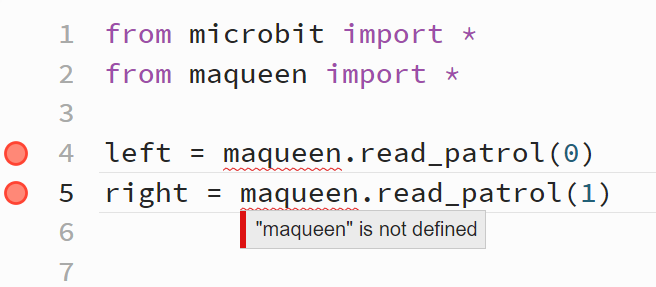

> [!success] Umfang
> 
> - Die Prüfung wird auf Exam.net stattfinden und 60 Minuten dauern. Sie umfasst sowohl Theorie als auch praktische Programmieraufgaben.
> - Sie werden Zugang [zum Microbit-Editor](https://python.microbit.org/v/3) und seiner Dokumentation haben, mit dem Sie dank dem Simulator auf der rechten Seite auch zuhause üben können.
> - Es gelten die Lernziele der Lektionen, die wir behandelt haben, sofern sie hier nicht ausgeschlossen werden:
> 	- Bei der Lektion [[microbit-05-buttons|zu den Knöpfen]] haben wir das Abbrechen der while-Schleife nicht behandelt.
> 	- Bei der Lektion [[microbit-03-leds|zu den LEDs]] haben wir die Knacknuss-Aufgaben nicht behandelt.
> 	- Beim [[microbit-10-maqueen-intro|Intro zum Maqueen-Roboter]] haben wir den Staubsauger mit der Zufallszahl nicht programmiert.
> 	- Beim [[microbit-14-linetracker|Linientracker]] haben wir die Geschwindigkeit nicht dynamisch angepasst.
> 	- [[microbit-15-linefinder|Linienfinder]] & [[microbit-20-radio|Radio]] haben wir nicht behandelt und das ist **nicht Teil des Prüfungsstoffs**.

Folgende Übungsaufgaben sollten Ihnen zur Prüfungsvorbereitung hilfreich sein. 
## Herz pocht nicht

Hilfe! Folgendes Programm zeigt immer nur ein grosses Herz an. Erklären Sie meinen Fehler und was man auf welchen Linien hinzufügen müsste.

```python showLineNumbers
from microbit import *

while True:
    display.show(Image.HEART)
    sleep(1000)
    display.show(Image.HEART_SMALL)
```

> [!solution]- Lösung
> 
> Nach `display.show(Image.HEART_SMALL)` wiederholt der Microbit die while-Schleife sofort und zeigt wieder das grosse Herz an. Man müsste also etwas **warten mit `sleep()`, z.B. `sleep(500)`**.

## Maqueen not defined

Wie könnte ich diese Fehler in meinem Programm lösen, damit ich nur auf einer Linie etwas ändern muss? Was müsste ich auf welcher Linie ändern und wieso?



> [!solution]- Lösung
> 
> Linie 2: `import maqueen`
> 
> Der Syntax `from maqueen import *` importiert den ganzen Inhalt direkt. Man müsste die Funktion `read_patrol()` dann direkt (ohne `maqueen.`) aufrufen. Aber das wären zwei Linien Code, die man verändern muss.
> 
> `import maqueen` hingegen importiert alles unter dem Namen `maqueen` - und so funktionieren auch die Linien 4 und 5 so, wie sie dastehen.

## Muster selbst zeichnen

Was für ein Muster generiert folgenden Code? Sagen Sie voraus, welche LEDs nach diesem Programm angestellt sein werden.

```python
from microbit import *

for i in range(1,4):
    display.set_pixel(i, 1, 9)

for i in range(1,2):
    display.set_pixel(i, 2, 9)

for i in range(0,3):
    display.set_pixel(2, i, 0)

display.set_pixel(3, 3, 0)
```

> [!solution]- Lösung
> 
> ![[microbit-led-pattern3.png]]

## Muster nachprogrammieren

Schreiben Sie ein Programm mit so wenigen Zeilen Code wie möglich, das folgendes Muster auf dem Display generiert. (Ohne Image() zu gebrauchen. Leerzeilen zählen nicht.)

![[microbit-90-examprep-pattern-1.png]]


> [!solution]- Lösung
> 
> ```python
> from microbit import *
> 
> for i in range(0,4):
>     display.set_pixel(1, i, 9)
> 
> for i in range(2,5):
>     display.set_pixel(i, 4, 9)
> 
> display.set_pixel(4, 1, 9)
> ```

## Spalten füllen

Schreiben Sie ein Programm, das im Sekundentakt ein LED nach dem andern der mittleren Spalte anstellt.


> [!solution]- Lösung
> 
> ```python
> from microbit import *
> 
> for i in range(5):
>     display.set_pixel(2,i,9)
>     sleep(1000)
> ```
> 

## Display füllen

Schreiben Sie ein Programm mit einer Funktion `fill(anzahl)`, die in den mittleren drei Spalten die gewünschte Anzahl LEDs anstellt. Ein Beispiel-Auftruf für 13 LEDs wäre `fill(13)` und würde so aussehen:

![[microbit-90-fillmiddle.png]]

> [!solution]- Lösung
> 
> ```python
> from microbit import *
> 
> def fill(anzahl):
>     angestellt = 0
>     for x in range(1,4):
>         for y in range(5):
>             if angestellt == anzahl:
>                 return
>             display.set_pixel(x,y,9)
>             angestellt += 1
> 
> fill(13)
> ```

## Display mit Knöpfen auffüllen

Erweitern Sie das fill()-Programm so, dass die Spalten nicht automatisch auffüllen, sondern dass man die Knöpfe A und B drücken kann, und dann jeweils ein LED mehr (Knopf B) oder weniger (Knopf A) anstellt. Achtung: Beachten Sie die "Edge-Cases" - d.h. die Randfälle, wenn Sie beispielsweise bereits keine LEDs angestellt haben und nochmal A drücken.

> [!solution]- Lösung
> 
> ```python
> from microbit import *
> 
> def fill(anzahl):
>     display.clear()
>     angestellt = 0
>     for x in range(1,4):
>         for y in range(5):
>             if angestellt == anzahl:
>                 return
>             display.set_pixel(x,y,9)
>             angestellt += 1
> 
> leds = 7
> fill(leds)
> 
> while True:
>     if button_a.was_pressed() and leds > 0:
>         leds -= 1
>         fill(leds)
>     if button_b.was_pressed() and leds < 15:
>         leds += 1
>         fill(leds)
> ```

## Maqueen spinnt!?

Hilfe! Mein Maqueen spinnt total, obwohl ich doch alles richtig mache?? Ich habe ihn zuerst so programmiert, dass er auf Weiss schnell fährt und auf Schwarz langsam. Alles lief tiptop. 

Nun wollte ich noch einbauen, dass er kurz vor einem Hindernis auf meinem Papier eine 180-Grad-Drehung macht und ausweicht - aber er fährt einfach volle Kanne in die Wand!

Erklären Sie mir bitte meinen Fehler und wie ich das verbessern könnte.

```python
from microbit import *
import maqueen

while True:
    
    if maqueen.read_patrol(0) == 1:
        maqueen.set_motor(0, 100)
        maqueen.set_motor(1, 100)
    
    if maqueen.read_patrol(0) == 0:
        maqueen.set_motor(0, 30)
        maqueen.set_motor(1, 30)
        
    if maqueen.read_distance() < 7:
        maqueen.set_motor(0, -100)
        maqueen.set_motor(1, 100)
```


> [!solution]- Lösung
> 
> Das Problem ist, dass die Motoren-Befehle des Ausweichmanövers nach `if maqueen.read_distance() < 7{:python}` sogleich wieder übersteuert werden. Die `while`-Schleife wiederholt ja sofort und misst die Helligkeit des Bodens.
> 
> Man müsste z.B. mit sleep() am Schluss des Blocks von `if maqueen.read_distance() < 7{:python}` eine gewisse Zeit warten.

## Dem Rand einer Figur folgen

Hilfe! Ich habe meinen Maqueen-Roboter so programmiert, dass er dem Rand einer Figur im Uhrzeiger folgt. Aber dann hat ein Sonnensturm meine Daten korrumpiert! Bitte reparieren Sie mein Programm!

![[microbit-06-examprep-randfolgen.excalidraw.light.svg]]

> [!solution]- Lösung
>
> Mit den Hilfsvariabeln `left` und `right`.
> 
> 1. `left == 1 and right == 0`
> 2. `left == 0 and right == 0`
> 3. `left == 1 and right == 1`
