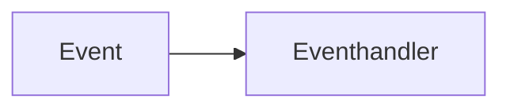

## Eventsteuerung: Ereignisse lösen etwas aus

Ob bei unserem Spiel, in komplizierteren Games, auf Webseiten, in Computerprogrammen – überall wo Sie **Interaktivität** erleben, braucht es die Grundidee, dass ein **Ereignis** etwas auslöst. Z.B. Klicken Sie auf diese Frage.

> [!question]- Was passiert wenn Sie hier klicken?
> 
> Der Inhalt ist aufgeklappt!

Das heisst: Ihr **Klick** (der **Event**) hat etwas im Code dieser Webseite ausgeführt (den **Eventhandler**). 



Genau dieselbe Logik brauchen wir für unser Spiel: Wir wollen nämlich, dass unsere zwei Turtle die Richtung ändern, wenn wir auf der Tastatur bestimmte Tasten drücken.
### Übung 1
> [!example] Zu zweit oder zu dritt
> 
> Kopieren Sie folgenden Code und versuchen Sie diese Fragen zu beantworten:
> 1. Wo im Code sehen Sie den **Event**?
> 2. Was könnte der **Eventhandler** sein?
> 3. **Was passiert** in TigerJython, wenn Sie eine Taste drücken?
> 4. Wo sehen Sie, **was für eine Taste** gedrückt wird?
> 5. Wie könnten wir aus diesen Informationen eine Steuerung bauen? Schreiben Sie **Pseudocode** im Klassennotizbuch, was Sie denken, in der Funktion `steuern(...)` passieren müsste.
> 
> ```python
> import gturtle
 >
> def steuern(key):
> 	print(key)
>     
 >tf = gturtle.TurtleFrame(keyPressed = steuern)
> 
> sara = gturtle.Turtle(tf)
> joe = gturtle.Turtle(tf)
> ```

Jetzt entwickeln wir eine erste Steuerung mit den Pfeiltasten für die Turtle `eva`.

> [!info] Eintrag ins Theorieheft
> 
> ## Eventsteuerung
> 
>  **Events** sind Ereignisse wie z.B. ein Mausklick, die **mit einem Eventhandler verknüpft** werden können. Wenn dann das Ereignis eintrifft, wird der Eventhandler ausgeführt. Eventhandler sind typischerwise eine **Funktion**.
>  
>  ```mermaid
> flowchart LR
> 	Event --> Eventhandler
> ```
> 
> Bei TigerJython passiert diese **Verknüpfung von Events und Eventhandlern** beim kreieren des Fensters. Hier verknüpfen wir den Event `keyPressed` (wenn auf der Tastatur eine Taste gedrückt wird) mit unsere Funktion `steuern(...)`, die unser Eventhandler ist.
> 
> ```
> def steuern(key):
> 	print(key)
> 
> tf = gturtle.TurtleFrame(keyPressed = steuern)
> ```
> 

## Tasten eindeutig identifizieren

Wenn Sie den Code in Übung 1 ausgeführt haben, erhalten Sie alle Informationen, die unserem Eventhandler vom Ereignis übergeben werden. 

```
java.awt.event.KeyEvent[KEY_PRESSED,keyCode=72,keyText=H,keyChar='h',keyLocation=KEY_LOCATION_STANDARD,rawCode=72,primaryLevelUnicode=104,scancode=35,extendedKeyCode=0x48] on ch.aplu.turtle.Playground[,0,0,801x601,layout=java.awt.FlowLayout,alignmentX=0.0,alignmentY=0.0,border=,flags=8,maximumSize=,minimumSize=,preferredSize=java.awt.Dimension[width=801,height=601]]
java.awt.event.KeyEvent[KEY_PRESSED,keyCode=65,keyText=A,keyChar='a',keyLocation=KEY_LOCATION_STANDARD,rawCode=65,primaryLevelUnicode=97,scancode=30,extendedKeyCode=0x41] on ch.aplu.turtle.Playground[,0,0,801x601,layout=java.awt.FlowLayout,alignmentX=0.0,alignmentY=0.0,border=,flags=8,maximumSize=,minimumSize=,preferredSize=java.awt.Dimension[width=801,height=601]]
java.awt.event.KeyEvent[KEY_PRESSED,keyCode=76,keyText=L,keyChar='l',keyLocation=KEY_LOCATION_STANDARD,rawCode=76,primaryLevelUnicode=108,scancode=38,extendedKeyCode=0x4c] on ch.aplu.turtle.Playground[,0,0,801x601,layout=java.awt.FlowLayout,alignmentX=0.0,alignmentY=0.0,border=,flags=8,maximumSize=,minimumSize=,preferredSize=java.awt.Dimension[width=801,height=601]]
java.awt.event.KeyEvent[KEY_PRESSED,keyCode=76,keyText=L,keyChar='l',keyLocation=KEY_LOCATION_STANDARD,rawCode=76,primaryLevelUnicode=108,scancode=38,extendedKeyCode=0x4c] on ch.aplu.turtle.Playground[,0,0,801x601,layout=java.awt.FlowLayout,alignmentX=0.0,alignmentY=0.0,border=,flags=8,maximumSize=,minimumSize=,preferredSize=java.awt.Dimension[width=801,height=601]]
java.awt.event.KeyEvent[KEY_PRESSED,keyCode=79,keyText=O,keyChar='o',keyLocation=KEY_LOCATION_STANDARD,rawCode=79,primaryLevelUnicode=111,scancode=24,extendedKeyCode=0x4f] on ch.aplu.turtle.Playground[,0,0,801x601,layout=java.awt.FlowLayout,alignmentX=0.0,alignmentY=0.0,border=,flags=8,maximumSize=,minimumSize=,preferredSize=java.awt.Dimension[width=801,height=601]]
java.awt.event.KeyEvent[KEY_PRESSED,keyCode=16,keyText=Shift,keyChar=Undefined keyChar,modifiers=Shift,extModifiers=Shift,keyLocation=KEY_LOCATION_LEFT,rawCode=16,primaryLevelUnicode=0,scancode=42,extendedKeyCode=0x10] on ch.aplu.turtle.Playground[,0,0,801x601,layout=java.awt.FlowLayout,alignmentX=0.0,alignmentY=0.0,border=,flags=8,maximumSize=,minimumSize=,preferredSize=java.awt.Dimension[width=801,height=601]]
java.awt.event.KeyEvent[KEY_PRESSED,keyCode=135,keyText=Dead Diaeresis,keyChar=Undefined keyChar,modifiers=Shift,extModifiers=Shift,keyLocation=KEY_LOCATION_STANDARD,rawCode=192,primaryLevelUnicode=168,scancode=27,extendedKeyCode=0x87] on ch.aplu.turtle.Playground[,0,0,801x601,layout=java.awt.FlowLayout,alignmentX=0.0,alignmentY=0.0,border=,flags=8,maximumSize=,minimumSize=,preferredSize=java.awt.Dimension[width=801,height=601]]
```

Wir erhalten pro Tastenschlag eine Zeile. Mögliche Arten, hier die Taste `h` zu identifizieren, wären:
- `keyCode=72`
- `keyText=H`
- `keyChar='h'`

Weil aber `keyText` und `keyChar` von der Spracheinstellung des Computers abhängen, brauchen wir `keyCode`.
### Übung 2
> [!example] Zu zweit oder zu dritt
> 
> Notieren Sie sich die **`keyCodes` der Pfeiltasten**. Tipp: Speichern Sie diese Zahlen in Helfervariabeln, dann müssen Sie sich diese Zahlen nicht merken - z.B.  mit `LEERTASTE = 32`.

Jetzt haben Sie also die keyCodes der Pfeiltasten. In der Funktion `steuern(...)` können Sie den **Wert des keyCodes der aktuell gedrückten Taste mit `key.keyCode`** abrufen und mit den gespeicherten keyCodes vergleichen. Sie können nun mit einer [if-Selektion](../../1-code/15-ifelse) arbeiten.
### Übung 3
> [!example] Zu zweit oder zu dritt
> 
> 1. Wie könnten Sie `eva` ein Kommando geben, wenn eine bestimmte Pfeiltaste gedrückt wird? Versuchen Sie das selbst zu programmieren.
> 2. Versuchen Sie, eine Steuerung für `eva` zu programmieren.


> [!info] Zusammenfassung
> 
> ## Tasten eindeutig identifizieren
> 
> - Der Event  `keyPressed` gibt die Info, **welche Taste** gedrückt wurde, als **Argument unserem Eventhandler `steuern(key)`** weiter. 
> - `key.keyCode` gibt eine **eindeutige Zahl** für die aktuelle gedrückte Taste an. Wir haben so die keyCodes für die Pfeiltasten herausgefunden.
> - Beispiel einer Steuerung:
> 	```python
> 	def steuern(key): 
> 		if (key.keyCode == KEY_RIGHT): 
> 			eva.right(90)
> 	```

